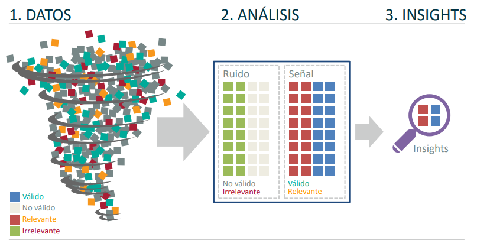

# DS4B_project
---
## Una semana como Data Scientist

**DIA 1: TU PRIMERA DÍA EN LA EMPRESA**

**¿Cuál es mi objetivo en la semana en mí empresa como Data Scientist?**
Analizar datos de la empresa mediante algoritmos avanzados y generar modelos de Machine Learning que permitan conseguir mejores resultados.

**¿Cuál es el principal problema de la empresa actualmente?**
El principal problema de la empresa es la fuga de empleados. Vas a crear un sistema que consiga reducir dicha fuga.

- Grave problema de perdida de empleados que repercuten en perdida de talento y gastos en reclutamiento de nuevos empleados.
- No hay una métrica clara de abandono, ni empleados en riesgo de renunciar.

**¿Qué necesitamos?**

- Entender cuantitativamente qué está pasando a nivel de negocio
- Crear un sistema basado en datos que ayude solucionar el problema
- Comunicar los resultados de forma exitosa a la dirección

---

**Qué hace la fase de Business Analytics**

**Datos:** Es indispensable trabajar con datos. Una base de datos que tenga toda la información del negocio u problema del negocio.

---

**Análisis:** En business Analytics se hace análisis para encontrar las señales de **ruido**. Encontrar cosas qué son relevantes para el negocio.

---

**Insights:** El objetivo de todo lo anterior, es **generar insights o conclusiones** importantes que tengan impacto para la toma de decisiones en el negocio. **Lo que a los clientes les interesa al final.**

**Stack Tecnológico para la fase de Business Analytics**

---

**¿Qué hace la fase de Machine Learning?**

Esta fase se centra en utilizar datos para hacer **predicciones, clasificaciones o encontrar patrones** que puedan ser difíciles de descubrir mediante métodos analíticos tradicionales.
👉 Incluye la selección de algoritmos, la preparación de datos, el entrenamiento de modelos y la evaluación del rendimiento.

---

**¿Qué hace la fase de productivización?**

Después de desarrollar y validar un modelo de machine learning efectivo, la productivización se refiere a **la integración y despliegue de ese modelo en un entorno operativo o de producción.**

Esto implica la creación de **dashboards**, **informes interactivos u otras herramientas visuales** para presentar de manera efectiva los insights derivados de los modelos de ciencia de datos.

---

**DÍA 2: BUSINESS ANALYTICS**

<aside>
🔥 El perfil mixto entre la parte técnica de un **Data Scientist** y la de **dominio del negocio (Business Analytics)** es la más demandada y más difícil de encontrar en la actualidad.

</aside>

---

**¿Qué es un DataFrame?**
Es una estructura de datos bidimensional y tabular que se utiliza comúnmente en programación para **manipular y analizar datos**. La idea principal detrás de un DataFrame es **organizar los datos en filas y columnas**, de manera similar a una hoja de cálculo o una tabla de base de datos.

Antes de iniciar, es importante conocer cuántos y qué tipos de datos contiene nuestro **DataFrame**. Para ello, utilizamos la función `df.info()`. Con ella obtenemos información clave sobre un DataFrame. **Los tipos de datos de las columnas, la cantidad de valores no nulos y el uso de memoria.** 

**Analisis de Calidad de Datos**

La **calidad de datos** se refiere a la medida en que los datos son precisos, consistentes, completos, relevantes y están libres de errores. En otras palabras, se trata de evaluar la confiabilidad y utilidad de los datos disponibles para su uso en **análisis, toma de decisiones y otras aplicaciones.**

**Análisis de Nulos** Esto es una muestra de un tipo de análisis de Calidad de Datos.

El **análisis de nulos** refiere al proceso de examinar y comprender la **presencia de valores nulos (o valores faltantes)** en un conjunto de datos.

👉   Los valores nulos pueden surgir por diversas razones, como la **recopilación de datos incompleta**, errores en la entrada de datos o simplemente la falta de información en ciertas observaciones.

![Este DataFrame contiene 6 valores nulos. El resto de los datos está completo.]

Este DataFrame contiene 6 valores nulos. El resto de los datos está completo.

**¿Qué se hace con los datos nulos?**

- Los valores de `anos_en_puesto` y `conciliacion` **pasarían a eliminar por haber muchos datos faltantes**.
    
    <aside>
    🔥 Cabe resaltar que este proceso debe hacerse cuando dichos datos faltantes no afecten al análisis para la resolución de problema.
    
    </aside>
    

👉 De esta forma eliminamos los valores del Dataframe:

---

<aside>
🔥 El análisis de nulos es una parte crucial del preprocesamiento de datos y es esencial para entender la calidad y la integridad de tus datos antes de realizar análisis más avanzados o construir modelos.

</aside>

---

---

**¿Qué hacemos con los datos nulos que no eliminamos?**

Los datos nulos restantes pasan por un proceso llamado **Imputación.** Imputar una variable se refiere a la acción de **asignar, estimar o aproximar valores** para las observaciones que tienen valores faltantes o nulos. **La imputación se realiza con el objetivo de llenar esos vacíos y permitir un análisis más completo de los datos.**

Hay varias estrategias de imputación, y la elección de una estrategia particular puede depender del tipo de variable y la naturaleza de los datos.

👉 En este caso, vamos a realizar la imputación de datos nulos asignando la **clase mayoritaria (media).** Para hacerlo, hacemos es útil pasar a la fase de Análisis exploratorio de datos (EDA).

**Análisis Exploratorio de Datos (EDA)**

El Análisis Exploratorio de Datos **(EDA: Exploratory Data Analysis)** es una fase crítica en el proceso de ciencia de datos. **Se centra en la exploración y comprensión inicial de los datos empleando a menudo métodos de visualización de datos.** El objetivo principal del EDA es descubrir patrones, detectar anomalías, probar una hipótesis o comprobar supuestos.

En EDA las variables se clasifican generalmente en dos tipos principales: **variables categóricas y variables numéricas.** Además de estas, también se pueden considerar variables de otros tipos, **como variables de texto o cadenas de caracteres, y variables temporales o de fecha.**

**Variables Categóricas:**
Son variables que representan categorías o clases discretas. Pueden ser nominales (sin orden) o ordinales (con un orden implícito).

**Ejemplos:** Género (Masculino/Femenino), Tipo de Producto (A/B/C), Nivel Educativo (Primaria/Secundaria/Universitaria).

**Variables Numéricas:**
Son variables que representan cantidades numéricas y pueden ser continuas o discretas.

**Ejemplos:** Edad, Ingresos, Número de Ventas, Puntuación en un Examen.

---

Durante el Análisis Exploratorio de Datos, la forma de abordar cada tipo de variable puede variar.

---

**EDA Variables Categoricas**

Para las variables categóricas, se pueden utilizar gráficos de barras o tablas de frecuencia para visualizar la distribución.

**EDA Variables Numéricas**

Para las variables numéricas, se pueden utilizar histogramas y estadísticas descriptivas.

---

### Generación de Insights

Esto consiste en realizar una serie de **preguntas semilla (preguntas importantes a las que es importante buscarle una respuesta)** para poder abordar el problema (Fuga de empleados en la empresa) y a partir de dichas respuestas, indagar más sobre el por qué de cada pregunta.

La generación de insights se refiere a la **identificación y comunicación de patrones, tendencias y conocimientos** valiosos derivados de la exploración y análisis de los datos.

---

Hoy hemos aprendido un montón sobre Business Analytics:

- Hemos visto lo que es la calidad de datos y por qué es tan importante
- Hemos hecho un análisis de nulos y corregido los errores
- Hemos realizado análisis exploratorio sobre todas nuestras variables
- Hemos aprendido un par de funciones para hacer EDA que nos permitirán analizar de un plumazo cientos de variables
- Hemos interiorizado un framework super útil para hacer Business Analyics y presentarlo de forma ganadora:
    - Paso 1: Cuantificación del problema
    - Paso 2: Impacto económico
    - Paso 3: Escenarios de ahorro
- Hemos experimentado todas las posibilidades de "tirar del hilo" que se nos abren cuando usamos esta metodología y cómo puedes aportar con ella gran valor práctico a las empresas

---

**DÍA 3: MACHINE LEARNING**
